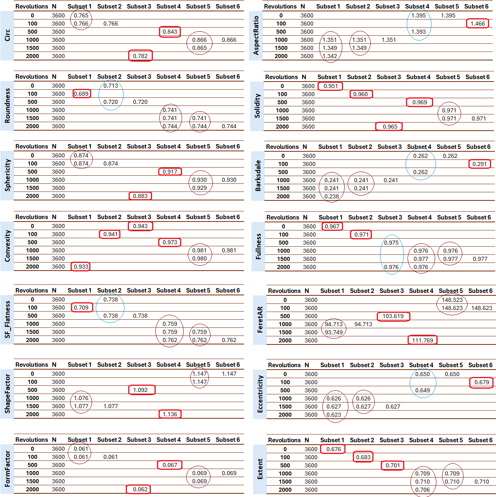
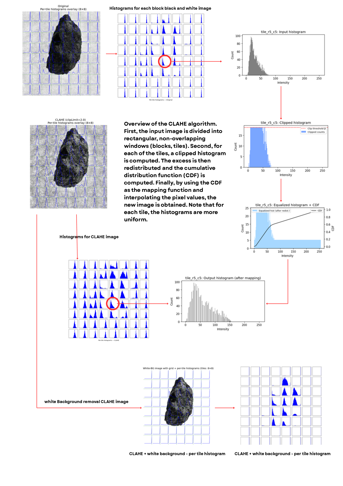
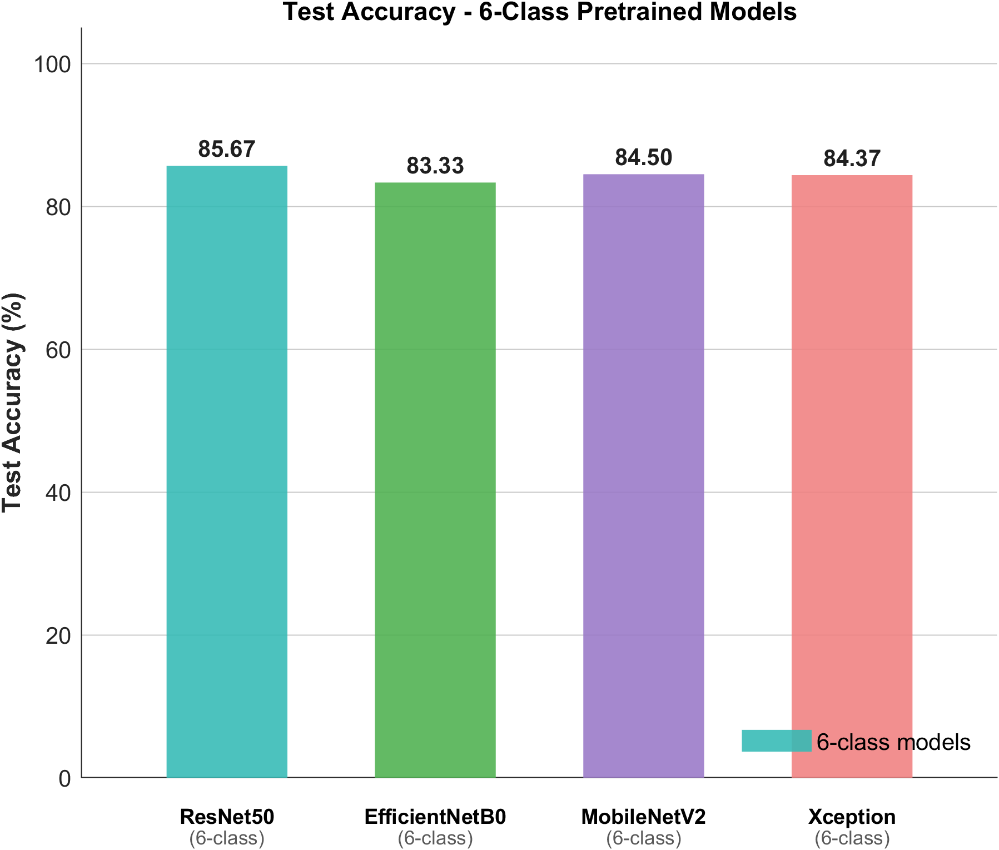
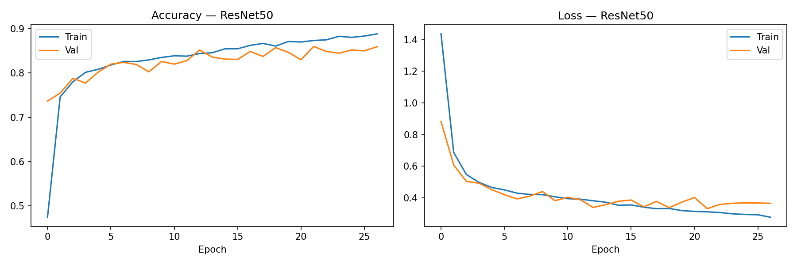
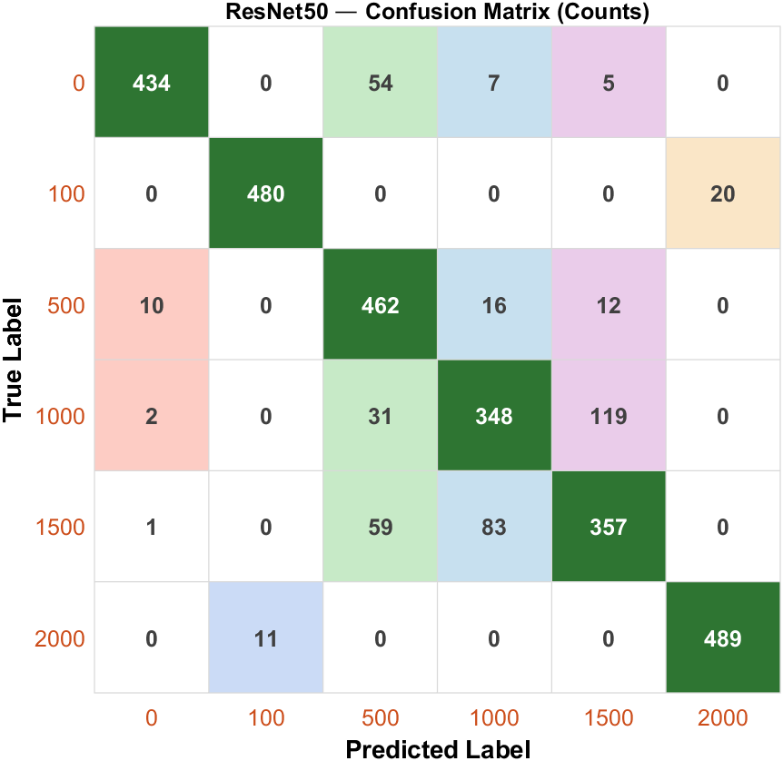

# Aggregate Shape Classification using Deep Learning

> **Final Year Project — Department of Computer Engineering, University of Jaffna, Sri Lanka**
>
> Deep learning pipeline for classifying construction aggregate shapes produced at different milling revolution speeds using CNN architectures and a hybrid CNN+SVM approach — implemented in PyTorch.

---

## Table of Contents
- [Project Overview](#project-overview)
- [Dataset](#dataset)
- [Preprocessing Pipeline](#preprocessing-pipeline)
- [Models](#models)
- [Results](#results)
- [Project Structure](#project-structure)
- [Installation](#installation)
- [Usage](#usage)
- [Authors](#authors)

---

## Project Overview

Construction aggregates are processed at different milling revolution speeds (0, 100, 500, 1000, 1500, and 2000 RPM), each producing a distinct particle shape and surface texture. This project builds an automated image classification system that identifies the milling class of an aggregate particle from a single photograph — replacing manual, time-consuming sieve analysis with a fast, camera-based approach.

The figure below shows how aggregate morphology evolves across the six milling stages:



*Morphological evolution of aggregate particles across six milling revolution classes: 0, 100, 500, 1000, 1500, and 2000 RPM.*

---

## Dataset

| Property | Value |
|---|---|
| Number of classes | 6 (0, 100, 500, 1000, 1500, 2000 RPM) |
| Images per class | 500 |
| Total images | 3,000 |
| Image type | RGB photographs of individual aggregate particles |
| Preprocessing | CLAHE enhancement + segmentation + white background |
| Input resolution | 224 × 224 px (resized for all models) |

---

## Preprocessing Pipeline

All aggregate images were preprocessed offline using **Contrast Limited Adaptive Histogram Equalization (CLAHE)** before training. CLAHE enhances local contrast while suppressing noise — critical for aggregate images with non-uniform illumination and irregular surface textures.

**Pipeline steps:**
1. Convert to grayscale
2. Apply CLAHE (clip limit = 2.0, tile grid = 8×8)
3. Binary thresholding + morphological opening
4. Largest-contour extraction to isolate the aggregate particle
5. Replace background with uniform white fill



*Schematic of the CLAHE preprocessing pipeline applied to an aggregate image.*

---

## Models

### Pretrained CNN Architectures (Transfer Learning)

All pretrained models were initialised with ImageNet weights and extended with a custom classification head:
> `Dropout(0.3)` → `Linear(→ 128-d embedding)` → `ReLU` → `Linear(→ 6 classes)`

| Model | Parameters | ImageNet Weights |
|---|---|---|
| ResNet50 | 23.8 M | Yes |
| EfficientNetB0 | 4.2 M | Yes |
| MobileNetV2 | 2.4 M | Yes |
| Xception | 21.1 M | Yes |

**Training configuration:**
- Optimiser: Adam (lr = 1×10⁻⁵)
- Batch size: 32
- Augmentation: horizontal flip, ±20° rotation, zoom 0.8–1.2, ImageNet normalisation
- Early stopping: patience = 5, minimum 20 epochs, best-weight restoration

---

### Custom CNN Architectures (Trained from Scratch)

Seven custom CNN architectures (CNN2–CNN8) were designed and trained from scratch to investigate how architectural depth affects classification performance on this domain-specific task.

| Model | Conv Layers | Parameters | Accuracy |
|---|---|---|---|
| CNN2 | 2 | ~115 K | 61.27% |
| CNN3 | 3 | ~436 K | 62.60% |
| CNN4 | 4 | ~1.8 M | 68.40% |
| CNN5 | 5 | ~6.5 M | 73.53% |
| **CNN6** | **6** | **~6.8 M** | **82.20%** |
| CNN7 | 7 | ~101 M | 81.13% |
| CNN8 | 8 | ~245 M | 67.07% |

CNN6 (6 convolutional layers: 3→32→64→128→256→512→1024) achieved the best accuracy among custom models at **82.20%** with a compact 27 MB weight file.

---

### Hybrid CNN + SVM

CNN6 was also used as a feature extractor. The 512-dimensional embeddings from the penultimate layer were passed through mRMR feature selection (96 features selected from 512) followed by a StandardScaler and an RBF-kernel SVM (C=10).

| Pipeline | Accuracy |
|---|---|
| CNN6 (FC head) | 82.20% |
| CNN6 → mRMR(96) → SVM | 82.33% |

---

## Results

### 6-Class Classification (All Milling Levels)



*Per-class and overall accuracy comparison across all pretrained and custom CNN models.*

| Model | Overall Accuracy |
|---|---|
| **ResNet50** | **85.67%** |
| MobileNetV2 | 84.50% |
| Xception | 84.37% |
| EfficientNetB0 | 83.33% |
| CNN6 + SVM | 82.33% |
| CNN6 | 82.20% |

### ResNet50 Training Curves



*ResNet50 training and validation loss/accuracy curves over training epochs.*

### ResNet50 Confusion Matrix



*Confusion matrix for ResNet50 on the 3,000-image test set (500 per class).*

---

### Subclass Experiments (ResNet50)

When the six-class problem was reduced to targeted four-class and three-class subsets, classification accuracy improved significantly:

| Experiment | Classes | Accuracy |
|---|---|---|
| 4-class (0, 100, 1000, 2000) | 4 | **97.50%** |
| 4-class (0, 100, 1500, 2000) | 4 | **97.50%** |
| 4-class (0, 100, 500, 2000) | 4 | 95.35% |
| 3-class (500, 1000, 1500) | 3 | 78.00% |

---

## Project Structure

```
aggregate-shape-classification/
├── preprocessing/               # CLAHE preprocessing & histogram analysis notebooks
├── pretrained_models/           # ResNet50, EfficientNetB0, MobileNetV2, Xception training
├── custom_cnn/                  # Custom CNN2–CNN8 and Hybrid CNN+SVM notebooks
├── subclass_experiments/        # 4-class and 3-class ResNet50 experiments
├── analysis/                    # ROC/PR curves, probability bar charts
├── images/                      # Key figures used in this README
└── requirements.txt
```

---

## Installation

```bash
# Clone the repository
git clone https://github.com/Jenarththan2001/aggregate-shape-classification.git
cd aggregate-shape-classification

# Create a virtual environment
python3 -m venv venv
source venv/bin/activate        # Linux/Mac
venv\Scripts\activate           # Windows

# Install dependencies
pip install -r requirements.txt
```

---

## Usage

Each notebook is self-contained. Open in Jupyter and update the dataset path at the top of the notebook before running:

```python
DATASET_DIR = "/path/to/your/dataset"   # update this line
```

**Recommended order:**
1. `preprocessing/` — understand the CLAHE pipeline first
2. `pretrained_models/ResNet50.ipynb` — best pretrained model
3. `custom_cnn/CNN6.ipynb` — best custom model
4. `custom_cnn/Hybrid.ipynb` — CNN + SVM pipeline
5. `subclass_experiments/` — targeted class experiments
6. `analysis/` — ROC/PR curves and visualisations

---

## Requirements

See [requirements.txt](requirements.txt) for the full list. Key dependencies:

| Package | Purpose |
|---|---|
| torch / torchvision | Model training and inference |
| timm | Xception model |
| scikit-learn | SVM, mRMR feature selection |
| opencv-python | CLAHE preprocessing |
| matplotlib / seaborn | Plots and visualisations |
| Pillow / numpy | Image handling |

---

## Authors

**A. Jenarththan, S. Nathiskar, V. Aarthy, P. Jeyananthan**
Department of Computer Engineering, University of Jaffna, Sri Lanka

**Supervisor: D. N. Subramaniam**
Department of Civil Engineering, University of Jaffna, Sri Lanka
